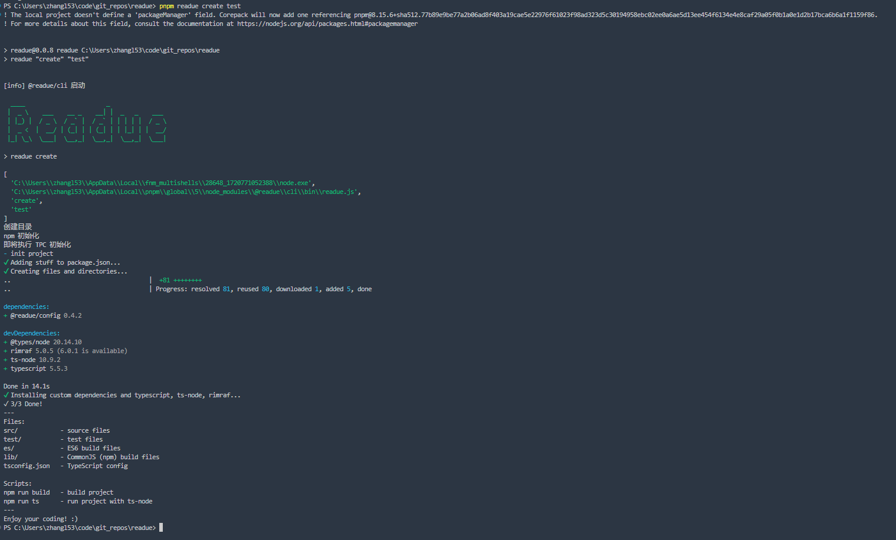

# 编写一个插件

我们以读取子包列表为例，来演示如何编写一个插件。

## 插件的基础结构

每一个块插件，都是一个单独的 npm 包。插件本身是一个函数，接收两个参数：

```js
// 插件入口文件
export default function (readueConfig, pkgJson) {
	return {
		name: "Packages", // 插件名称
		content: []  // 插件内容 字符串数组，每一个元素对应 Markdown 文档中的一行
	}
}
```

## 初始化插件包

@readue/cli 提供了一键初始化自定义插件包的命令，方便开发者快速编写插件。

首先确保你已经安装了 `@readue/cli`，如果没有安装，请执行如下命令：

```shell
npm install @readue/cli -g
```

切换到合适的目录，执行如下命令：

```bash
readue create test
```

等待下面的过程执行完毕，插件就初始化成功了，你可以编辑 `src/index.ts` 来修改你的插件逻辑。



## 编写插件

在上一步中，我们已经初始化了插件包的整体结构，现在我们在入口文件 `src/index.ts` 替换为如下内容：

```ts
import type { PackageJson } from "pkg-types";
import { ReadueConfig } from "@readue/config";
import * as fs from "fs";
import * as path from "path";

// 导出内容生成器函数
export default function (
	_readueConfig: ReadueConfig,
	pkgJson: PackageJson,
	options: {
		cwd: string;
	} = {
		cwd: process.cwd(),
	}
) {
	let content: string[] = [
		"# Packages",
		"", // 标题和内容之间空一行
	];

	const packages = fs.readdirSync(path.resolve(options.cwd, "./packages"));
	if (packages?.length) {
		packages.forEach((item) => {
			// 列出每一个子目录的名称
			content.push(`- ${item}`);
		});
	}

	return {
		name: "Packages", // 插件名称
		content: [
			// 插件内容 字符串数组，每一个元素对应 Markdown 文档中的一行
			...content,
		],
	};
}
```

这样我们就完成了一个子包列表信息插件的编码，然后我们将上面编写的插件，发布到 npm 仓库中。

## 使用插件

在 `.readue/config.js` 中通过 `blocks` 配置项注入插件：

```js
// readue.config.ts
module.exports = {
	/**
	 * 自定义块配置
	 */
	blocks: {
		type: "custom",
		list: ["@readue/block-test"],
	},
};
```

重新执行 `readue gen` 命令，就能在 READEME.md 中看到仓库的子包信息了。
